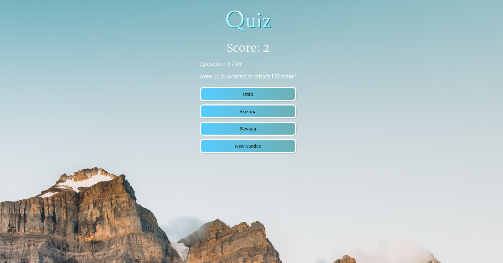

# Workshop du 16 décembre 2021

## Création d'un quiz en Typescript et React

Vous trouverez ici toutes les informations et les ressources nécessaires pour suivre le workshop ainsi que l'image (libre de droits) que vous pouvez utiliser pour le background de votre Quiz.

# Ressources pour créer l'application :

* Info sur le set up de Typescript avec React : https://react-typescript-cheatsheet.netlify.app/docs/basic/setup/

    Créer l'app avec la commande : `npx create-react-app name-of-app --template typescript`

* Ici, une proposition de **font** que vous pouvez utiliser : https://fonts.google.com/specimen/Catamaran

* Vous trouverez l'**image** ("tim.jpg") pour le background du quiz.

* API pour les questions / réponses : https://opentdb.com/api_config.php

* Informations sur le DOMPurify : https://www.npmjs.com/package/dompurify

    Pour installer le package, faire la commande : `npm i dompurify`

# Ressources supplémentaires :

* https://react-typescript-cheatsheet.netlify.app/
* https://www.typescriptlang.org/
* https://www.jesuisundev.com/comprendre-typescript-en-5-minutes/
* https://blog.cellenza.com/developpement-specifique/web-developpement-specifique/introduction-a-typescript/
* https://www.typescripttutorial.net/